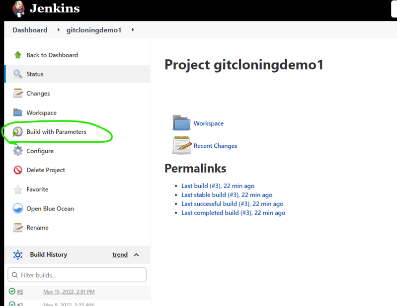
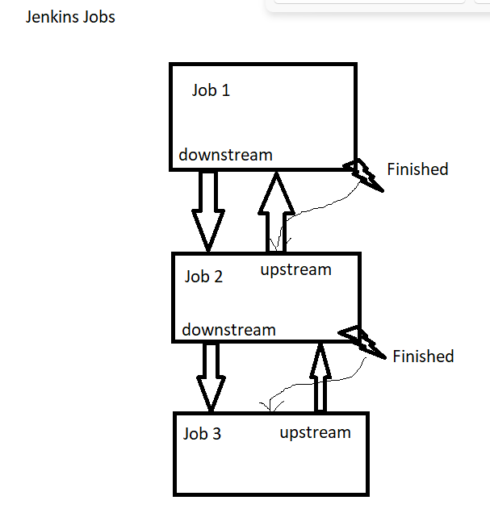
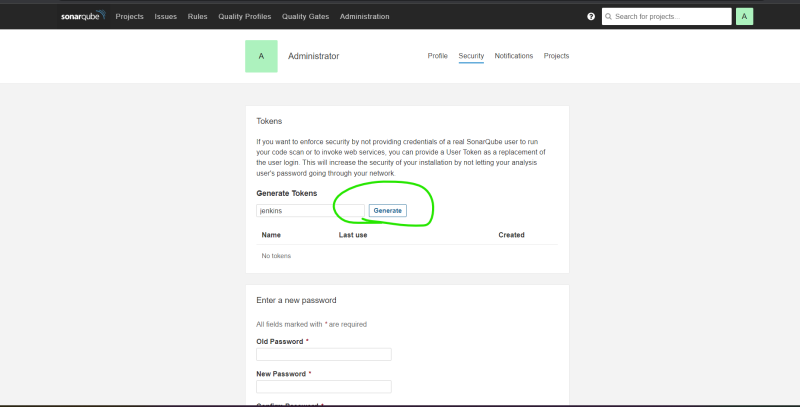

### Paramitarized Build
*  If you want to give an option to the user who is building the jobs, then we call these variables are parameters.
* Lets look at free style project





* Adding parameter to declartive pipeline

```
pipeline {
    agent any
    tools {
        // Install the Maven version configured as "M3" and add it to the path.
        maven "M3"
    }
    options { 
        timeout(time: 1, unit: 'HOURS')
        retry(2) 
    }
    triggers {
        cron('0 * * * *')
    }
    parameters {
        choice(name: 'GOAL', choices: ['compile', 'package', 'clean package'])
    }
    stages {
        stage('Source Code') {
            steps {
                git url: 'https://github.com/devops-easy/spring-petclinic.git', 
                branch: 'master'
            }

        }
        stage('Build the Code') {
            steps {
                sh script: 'mvn clean package'
            }
        }
        stage('reporting') {
            steps {
                junit testResults: 'target/surefire-reports/*.xml'
            }

        }
    }
    post {
        success {
            // send the success email
            echo "Success"
            mail bcc: '', body: "BUILD URL: ${BUILD_URL} TEST RESULTS ${RUN_TESTS_DISPLAY_URL} ", cc: '', from: 'devops@qtdevops.com', replyTo: '', 
                subject: "${JOB_BASE_NAME}: Build ${BUILD_ID} Succeded", to: 'devopseasy@gmail.com'
        }
        unsuccessful {
            //send the unsuccess email
            mail bcc: '', body: "BUILD URL: ${BUILD_URL} TEST RESULTS ${RUN_TESTS_DISPLAY_URL} ", cc: '', from: 'devops@qtdevops.com', replyTo: '', 
                subject: "${JOB_BASE_NAME}: Build ${BUILD_ID} Failed", to: 'devopseasy@gmail.com'
        }
    }
}
```

## Upstream and downstream jobs
* Lets assume we configure the jenkins jobs in the following way

* How to acheive?
* Option 1: Post Build Actions




* Option 2: Build Triggers


### Static Code Analysis Tools
* Analysis tools can try to suggest best practices in key areas
    * Architecture and Design
    * Comments
    * Coding Rules
    * Potential Bugs
    * Duplications
    * Unit Tests
    * Complexity
    * Sonar Qube is an open platform for managing code quality
    * There are multiple versions of sonar qube and we will be using the community edition


* The latest version of the sonarqube can be downloaded from here [Refer Here](https://binaries.sonarsource.com/Distribution/sonarqube/sonarqube-9.4.0.54424.zip)
* Sonar Qube requirements: [Refer Here](https://docs.sonarqube.org/latest/requirements/requirements/)
* For installing jdk 11 and postgres
* After installing and changing the password of the sonarqube generate the token



* Lets configure Sonarqube with Jenkins
* [Refer Here](https://www.jenkins.io/doc/pipeline/steps/sonar/#withsonarqubeenv-prepare-sonarqube-scanner-environment) for the sonar qube pipeline configuration.
* The pipeline we have configured is

```

```

* Now lets do sonarqube analysis for openmrs-core

```
```

* If you want build to be failed when the code analysis shows errors, we can configure Quality Gate.
* A Quality Gate can be created as per organizational standards


* Added wait for quality gate

```
```
