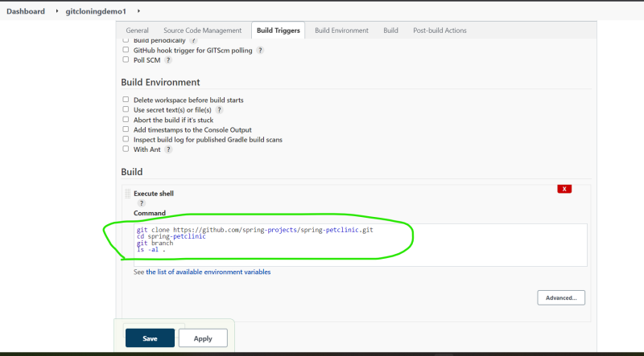
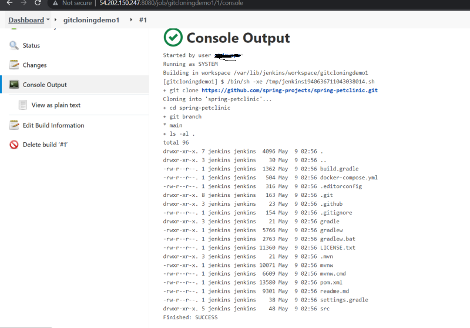
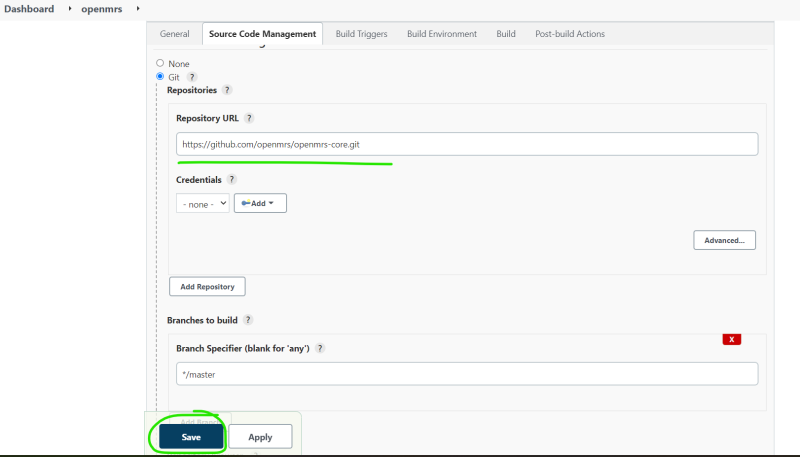
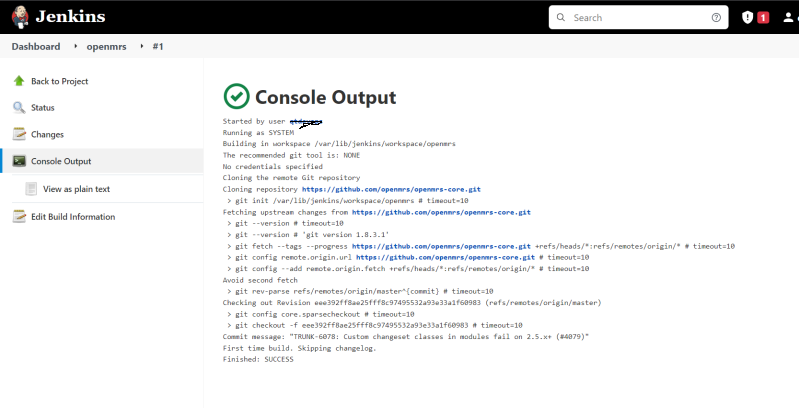
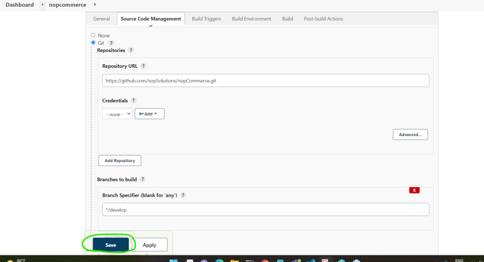
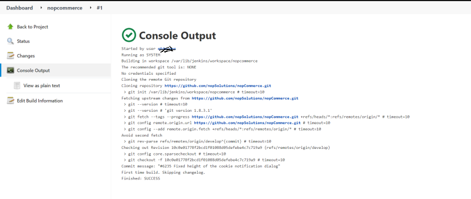
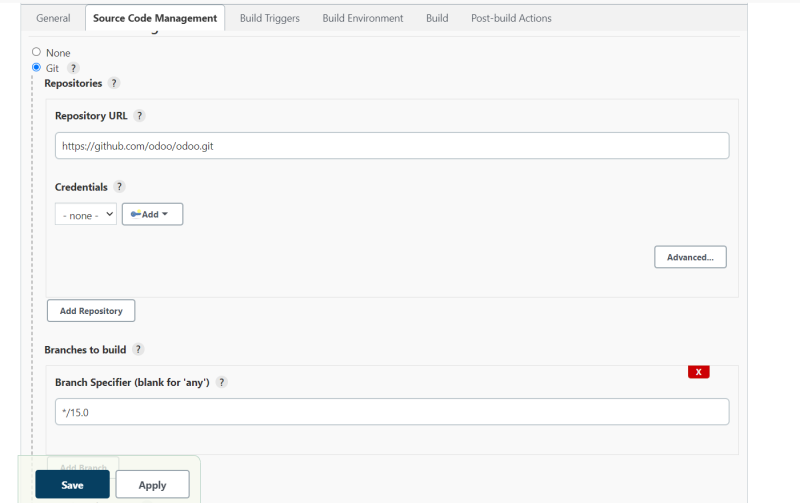

### Jenkins Contd
* We use Jenkins to create CI/CD pipelines which generally starts from the version control system like git.
* We need to clone the code and start building a package.
* Building a package depends on the language of your application.
* Cloning the code from git
    * git url
    * credentials (username/password or ssh key)
    * branch

* Lets consider the following two java opensource applications
    * spring pet clinic:
    * developed in java
    * requires jdk 11
    * repo url: [Refer Here](https://github.com/spring-projects/spring-petclinic)
    * Lets clone

    

    

    Open MRS:
      * developed in Java
      * This is open medical record system
      * repo url: [Refer Here](https://github.com/openmrs/openmrs-core)

* Jenkins will provide User Interfaces to help us increase the pace of creating cicd pipelines. These User Interfaces are added to jenkins by a concept called as plugins.
* While installing jenkins we have executed install plugins
* The UI below is from a plugin called as git plugin

* Lets clone openmrs

* Lets consider the following .net opensource application and clone it
* nop commerce
* default branch: develop
* Create a new jenkins job to clone the code [Refer Here](https://github.com/nopSolutions/nopCommerce) for repo url

* Clone the odoo [Refer Here](https://github.com/odoo/odoo) with default branch as v16.0

* As discussed in the session, We can clone code from git repo (public or private).
Now we should be able
   * to create the package/build from the cloned code.
   * unit test the code and show the test results

* The above steps change from technology (java, .net, python, nodejs)
* To understand the build system and the unit test lets start by learning a tool called as maven, which helps in build a package for java based languages.

### Building/Packaging the Code
* Building the Code:

* Dependencies and Artifact Repositories:

* Unit Test:

* For your organization project:

   * How to download the dependencies
   * How to build the code and what are the tools used?
   * How to run unit tests and generate the unit test report
   * How to run the Code Coverage and generate the report
   * How to run the Static Code Analysis and generate the report
   * How to create the Quality Gate to fail the build if the code coverage or static code anlaysis is not acceptable (optional)

* Responsibilities of the DevOps Engineer on topics discussed so far

